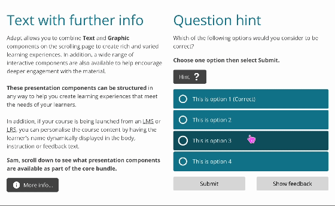

# adapt-hint

**Hint** is a Kineo *presentation extension*.

The extension adds a small, clickable icon to a component that displays additional information.

## Installation

Open the */src/extensions* folder in a new terminal window on Mac OSX or right click the folder and select 'Git Bash Here' on Windows.

Git clone the component, making sure to delete the hidden **.git** folder from the *adapt-hint* folder.

## Settings Overview

The attributes listed below are used in *components.json* to configure **Hint**, and are properly formatted as JSON in [*example.json*](https://github.com/cgkineo/adapt-hint/blob/master/example.json).

## Attributes

**_items** (array): Multiple items may be created. Each item represents one element of the hint extension and contains values for **title**, and **body**.

>**title** (string): The title of the particular item.

>**body** (string): The body text content of the particular item.

**_isNotifyPopup** (boolean): When set to true, hint item(s) are displayed using Notify, the core FW functionality that handles popups. The default is false. When false, hint item(s) overlay the component.

## Accessibility
Please use **_isNotifyPopup** for best accessibility experience.

## Limitations

----------------------------
**Version number:** 3.0.0  
**Framework versions:** 5.5+  
**Author / maintainer:**  Kineo  
**Accessibility support:** Yes  
**RTL support:** Yes  
**Cross-platform coverage:** To be confirmed  
